# 🚀 VPS-Ops v2.0: DMZ 无状态云端堡垒机

<div align="center">

**零基础 · 全自动 · 无需公网 IP · SQLite 原子性备份**

[](LICENSE)
[](https://docs.docker.com/compose/)
[](https://www.cloudflare.com/)

</div>

---

## 📖 这是一个什么项目？

VPS-Ops 是一个 **"基础设施即代码 (IaC)"** 的自动化部署方案。它能将一台全新的 VPS，通过一条命令，变成一个**安全、现代、功能强大**的私人云端堡垒机。

该 VPS 定位为家庭数据中心（NAS）的"公网前哨站、安全清洗网关、Tailscale 底层穿透节点"。

---

## 🏗️ 架构总览

```mermaid
graph TD
    User((用户)) --> CF[Cloudflare 全球边缘节点]
    CF --> Tunnel[🔒 安全隧道]

    subgraph VPS [VPS 服务器 /opt/vps-dmz/]
        Tunnel --> |vps_tunnel_net| Services

        subgraph Infra [基础设施层]
            ACME[acme.sh 证书管理]
            Watchtower[自动更新]
        end

        subgraph Services [业务逻辑层]
            NewAPI[new-api: AI 接口网关]
            MusicAPI[music-api: 音乐后端]
            Unblock[unblock-netease: 解灰代理]
            FastAPI[fastapi-gateway: 统一网关]
            NginxRelay[nginx-relay: NAS 桥接]
            Uptime[uptime-kuma: 监控面板]
        end

        subgraph Management [管理面板层]
            Dockge[dockge: 容器管理]
            Homarr[homarr: 导航仪表盘]
        end

        subgraph Backup [灾备系统]
            Kopia[Kopia 增量备份] --> WebDAV[☁️ 坚果云]
        end
    end

    DERP[derper: Tailscale DERP] -.->|TCP:33445 + UDP:3478| User
    NginxRelay -.->|Tailscale 100.x.x.x| NAS[🏠 家庭 NAS]
```



### 域名体系

| 二级域名 | 服务 | 说明 |
|:---|:---|:---|
| `new-api.660415.xyz` | New API | AI 接口管理 |
| `music-api.660415.xyz` | Music API | 音乐后端 |
| `api.660415.xyz` | FastAPI 网关 | 统一 API 入口 |
| `status.660415.xyz` | Uptime Kuma | 监控面板 |
| `music.660415.xyz` | CF Pages | 音乐前端 (静态托管) |
| `webhook.660415.xyz` | nginx-relay | Webhook → NAS |
| `dockge.660415.xyz` | Dockge | 容器管理 (Access 保护) |
| `home.660415.xyz` | Homarr | 导航页 (Access 保护) |
| `derp.660415.xyz` | DERP | Tailscale 中继 (直连) |

---

## 📁 目录结构

```text
vps-ops/                          # Git 仓库
├── compose/
│   └── docker-compose.yml        # 唯一核心编排文件 (14 个服务)
├── config/
│   ├── nginx-relay/nginx.conf    # Nginx 反代配置
│   └── fastapi-gateway/          # FastAPI 网关代码
├── scripts/
│   ├── init_host.sh              # 裸机一键初始化
│   ├── backup_kopia.sh           # 原子性备份
│   ├── cert_renew.sh             # 证书续期回调
│   └── prune.sh                  # Docker 清理
├── presets/                      # Shell 预设
├── .github/workflows/            # CI/CD
├── .env.example                  # 环境变量模板
└── config.ini                    # 基础配置
```

VPS 部署后的运行时目录：

```text
/opt/vps-dmz/                     # 四维隔离
├── docker-compose.yml
├── config/   → 静态配置 (只读挂载)
├── data/     → 核心数据 (Kopia 备份)
└── logs/     → 日志数据 (不备份)
```

---

## ⚡️ 极速安装

### 1. 准备工作

- 一台 VPS (2 核 2G+，Debian 11/12 或 Ubuntu 20.04+)
- 一个域名 (托管在 Cloudflare)
- Cloudflare Tunnel Token + DNS API Token
- 坚果云 WebDAV (可选，用于备份)

### 2. 部署

```bash
# 克隆仓库
git clone https://github.com/FenLynn/vps-ops.git /opt/vps-dmz
cd /opt/vps-dmz

# 配置秘密文件
cp .env.example .env
nano .env

# 一键发射 🚀
sudo bash scripts/init_host.sh
```

### 3. 配置 Cloudflare
去 [Zero Trust Dashboard](https://one.dash.cloudflare.com/) 配置 Tunnel 路由，将各二级域名指向对应容器。

---

## 🤖 GitOps 自动控制 (GitHub Actions)

本项目推荐使用 **GitOps 零接触部署**：你不需要登录 SSH，甚至可以把 VPS 密码忘掉。一切操作通过 GitHub Actions 完成。

### GitHub Secrets 配置清单 (必录)

请在仓库 `Settings -> Secrets and variables -> Actions` 中录入以下 7 个变量：

| Secret 名称 | 示例/建议值 | 说明 |
|:---|:---|:---|
| `VPS_HOST` | `1.2.3.4` | VPS 公网 IP |
| `VPS_ROOT_PASS` | `YourPass` | **仅首次初始化用**：VPS root 初始密码 |
| `VPS_SSH_PRIVATE_KEY` | `-----BEGIN...` | **钥匙**：本地生成的 SSH 私钥 |
| `VPS_SSH_PUBKEY` | `ssh-ed25519...` | **锁**：本地生成的 SSH 公钥 |
| `VPS_ENV_CONTENT` | *(全文内容)* | **配置文件**：`.env` 文件的全部内容（含注释） |
| `VPS_SSH_PORT` | `22222` | 初始化完成后的 SSH 端口 |
| `VPS_USER` | `sudor` | 初始化完成后使用的管理账号 |

> **提示**：`VPS_ENV_CONTENT` 采取的是“全文注入”方案。你直接把本地带有 `#` 编号注释、空格、甚至空行的 `.env` 内容全选复制进去即可。

---

## 🛡️ 安全特性

- **零端口暴露**: 除 DERP (TCP 33445 + UDP 3478) 和 SSH 外，所有端口关闭
- **Cloudflare Access**: 管理面板 (Dockge/Homarr) 强制邮箱 OTP 验证
- **WAF 防盗刷**: music-api 仅允许 music.660415.xyz Referer 访问
- **SSH 加固**: Fail2Ban 自动生效；禁 root / 禁密码 / 改端口需**手动执行**（见文末章节）
- **加密备份**: Kopia AES 加密后上传到坚果云

## 💾 备份系统

采用 SQLite 原子性备份铁律：
1. `docker pause` 冻结数据库容器
2. Kopia 精准快照 (排除 .shm/.wal)
3. `docker unpause` 恢复业务 (< 10 秒)
4. 自动清理过期快照


## 📝 更新测试证书为生产证书
```bash
# 1. 改 .env
sed -i 's/ACME_STAGING=true/ACME_STAGING=false/' /opt/vps-dmz/.env

# 2. 清除测试证书
rm -rf /opt/vps-dmz/data/acme/*

# 3. 重新申请
docker compose up -d --force-recreate acme acme-init derper
```


---

## 💡 GitOps 进阶 FAQ

### Q1: 关于 SSH 端口与登录策略
- **首次部署 (`bootstrap.yml`)**：`root` + 密码 + 端口 `22`（新 VPS 默认状态）。
- **初始化后**：`init_host.sh` 创建 `sudor` 用户并注入 SSH 公钥，端口/密码策略**不自动修改**，需参考文末"手动安全加固"章节完成锁定。
- **后续更新 (`deploy.yml`)**：`sudor` + SSH 私钥 + 端口 `22222`，全自动无需密码。

### Q2: `.env` 内容可以带注释吗？
**完全可以。** 
`VPS_ENV_CONTENT` 是采取的“全文注入”方案。你直接把本地带有 `#` 注释、空格、甚至空行的 `.env` 内容全选复制进去即可。脚本会原封不动地在 VPS 上生成对应的文件。

### Q3: 想增加新服务（如 Jellyfin）怎么办？
1. 在本地修改 `compose/docker-compose.yml`，增加 Jellyfin 容器配置。
2. (可选) 如果有新密钥，更新到 GitHub 的 `VPS_ENV_CONTENT` Secret 中。
3. `git commit` & `git push`。
4. GitHub Actions 会自动触发 `deploy.yml`，在 VPS 上执行 `docker compose up -d`，新服务即刻上线。

### Q4: 想要同时管理多台 VPS 怎么办？
本方案具有极强的可横向扩展性，详见下方 **多机器管理** 章节。

---

## 🌐 扩展方案：多机器管理 (Environments)

如果你有多台 VPS（如香港节点、美国节点），可以使用 GitHub 的 **Environments** 功能进行隔离管理：

### 1. 创建环境隔离
- 进入仓库 `Settings -> Environments`。
- 点击 **New environment** 分别创建 `HK-Server` 和 `US-Server`。
- 将上述 7 个 Secrets 分别填入对应的 Environment 下（而不是 Repository secrets）。

### 2. 初始化新机
- GitHub Actions 运行 `🚀 Bootstrap` 时，在弹出的下拉菜单中选择对应的目标环境（如 `HK-Server`）。
- Actions 会自动从对应的“保险箱”取密钥进行部署。

### 3. 环境逻辑
- 你可以在 GitHub Actions 页面一眼看到每个环境目前的运行版本。
- 也可以设置“保护规则”，例如：推送到 `Production` 环境的代码必须经过你的手动点击批准。

---

# 🍼 零基础“保姆级”部署教程 (傻瓜版)

> **目标**：从零开始，在 GitHub Actions 上点一下，完成 VPS 全自动初始化。

### 第一步：生成“钥匙”对 (在你的本地电脑操作)

1.  在 Windows 或 Mac 的终端输入这一行并回车：
    ```powershell
    ssh-keygen -t ed25519 -f vps-ops-key -N ""
    ```
2.  你的当前目录下会生成两个文件：
    -   `vps-ops-key` (这是 **私钥**，对应钥匙)
    -   `vps-ops-key.pub` (这是 **公钥**，对应锁)
3.  用记事本打开它们，准备好内容。

---

### 第二步：获取 Cloudflare 的两个核心 Token

#### 1. Tunnel Token (`CF_TOKEN`)
-   登录 [Cloudflare Zero Trust](https://one.dash.cloudflare.com/) 
-   点击左侧 `Networks` -> `Tunnels` -> `Create a tunnel`。
-   起个名（如 `vps-vm`），选择 `Docker`。
-   **看屏幕上的命令**，找到 `--token` 后面那一长串乱码（以 `eyJh...` 开头），复制它。
-   **格式示例**：`eyJhIjoi...` (一长串字母数字)

#### 2. DNS API Token (`CF_DNS_API_TOKEN`)
-   去 [API Tokens 页面](https://dash.cloudflare.com/profile/api-tokens)。
-   点击 `Create Token` -> 使用 `Edit zone DNS` 模板。
-   在 `Zone Resources` 选 `Specific zone` -> 选择你的域名。
-   点击 `Continue` -> `Create Token`。
-   **格式示例**：`abc123456789...` (通常 40 位左右)

---

### 第三步：获取坚果云备份密码 (可选)

-   登录坚果云 -> `账户信息` -> `安全选项` -> `第三方应用管理`。
-   点击 `添加应用` -> 输入 `vps-ops-backup`。
-   点击 `生成密码`。
-   **格式示例**：`abcd-efgh-ijkl-mnop` (带连字符的字母)

---

### 第四步：录入 GitHub Secrets (这是最重要的一步！)

1.  打开你的代码仓库页面 -> `Settings` -> `Secrets and variables` -> `Actions`。
2.  点击 `New repository secret`，一个个录入这 7 个密钥：

| 名称 | 如何获取 / 格式 |
|:---|:---|
| `VPS_HOST` | 你的 VPS 的 **公网 IP** (如 `123.45.67.89`) |
| `VPS_ROOT_PASS` | 供应商给你的 **root 账户原始密码** |
| `VPS_SSH_PRIVATE_KEY` | 拷贝第一步生成的 `vps-ops-key` 全文 (含 `-----BEGIN...`) |
| `VPS_SSH_PUBKEY` | 拷贝第一步生成的 `vps-ops-key.pub` 全文 (只有一行) |
| `VPS_ENV_CONTENT` | **全选复制** 仓库里的 `.env.example` 内容，把里面的 Token 换成你刚才撸到的。 |
| `VPS_SSH_PORT` | 直接填 `22222` (建议) |
| `VPS_USER` | 直接填 `sudor` (建议) |

---

### 第五步：起飞！🚀

1.  点击仓库顶部的 **Actions** 标签。
2.  点击左侧的 `🚀 Bootstrap: 初始化全新 VPS`。
3.  点击右侧的 `Run workflow` 按钮。
4.  如果是第一次，目标环境选 `Production` 即可，点击绿色按钮。
5.  **喝杯咖啡** 🫖。大约 5-10 分钟，当图标变绿，你的堡垒机就满血上线了！

---

## 🔒 手动安全加固（所有服务就绪后执行）

> **何时执行？** `bootstrap.yml` 跑完、容器正常、且**确认可以用 SSH 私钥从端口 22222 登录 `sudor` 账号**之后再执行。
>
> **为什么手动？** 锁端口/禁密码不可逆，操作前必须确认新的连接方式可用。

### 第一步：检查并确保 SSH 通道畅通

初始化完成后，系统默认进入**宽松登录模式**（双端口、双用户、双认证）。如果你想核实或手动设置，请确保配置如下：

```bash
sudo -i

cat > /etc/ssh/sshd_config.d/99-vps-ops.conf << 'EOF'
# 宽松模式认证：保持 22 和 22222 同时可用
Port 22
Port 22222
PermitRootLogin yes
PasswordAuthentication yes
PubkeyAuthentication yes
AuthorizedKeysFile .ssh/authorized_keys
X11Forwarding no
EOF

# 重启 SSH 使得配置生效
systemctl restart ssh
```

### 第二步：防火墙确认

确保 UFW 放行了必要的端口：
```bash
ufw allow 22/tcp
ufw allow 22222/tcp
ufw --force enable
```

### 第二步：关闭云控制台端口 22

**阿里云控制台 → 安全组 → 入方向规则** → 将端口 22（SSH 系统规则，优先级 100）改为**拒绝**。

### 验证加固结果

```bash
# 本地执行: 新端口应可正常登录
ssh -i vps-ops-key -p 22222 sudor@<VPS_IP> echo "OK"

# 旧端口 22 应超时或被拒绝
ssh -o ConnectTimeout=5 -p 22 sudor@<VPS_IP>
# Connection refused 即为成功

# root 登录应被拒绝
ssh -i vps-ops-key -p 22222 root@<VPS_IP>
# Permission denied (publickey). 即为成功
```

---

<div align="center">

**Enjoy your new server! 🥂**

Made with ❤️ by FenLynn

</div>

