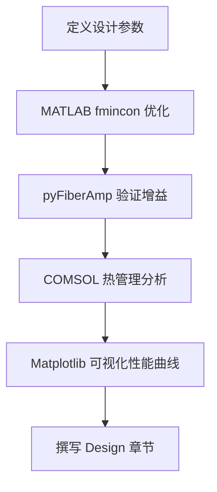

# Matplotlib / MATLAB / COMSOL Skills 安装配置完整教程

本教程将指导你如何为 Antigravity/Claude 配置三大核心科研工具的 AI 增强能力。

---

## 📋 目录

1. [Matplotlib Visualization Skill](#1-matplotlib-visualization-skill)
2. [MATLAB MCP Server Integration](#2-matlab-mcp-server-integration)
3. [COMSOL Multiphysics AI 集成](#3-comsol-multiphysics-ai-集成)
4. [综合工作流示例](#4-综合工作流示例)
5. [常见问题排查](#5-常见问题排查)

---

## 1. Matplotlib Visualization Skill

### 1.1 功能概述
Matplotlib Skill 是一个专家级的可视化助手，能够帮助你：
- 创建发表级科学图表（符合 Nature/Science 标准）
- 生成从基础折线图到复杂 3D 可视化
- 自动配置导出设置（DPI、尺寸、格式）
- 支持静态、动画和交互式可视化

### 1.2 前置要求
- ✅ Python 3.8+
- ✅ 已安装 `matplotlib`, `numpy`, `scipy`
- ✅ Antigravity 已配置完成

### 1.3 安装步骤

#### 方法 1：从 claude-scientific-skills 安装（推荐）

**Step 1: 克隆仓库**
```bash
cd C:\Users\lify\.gemini\antigravity\storage
git clone https://github.com/K-Dense-AI/claude-scientific-skills.git
```

**Step 2: 定位 Matplotlib Skill**
浏览仓库目录，找到 Matplotlib 相关的 Skill 文件夹：
```bash
cd claude-scientific-skills
# 查找包含 "matplotlib" 或 "visualization" 的文件夹
dir /s | findstr /i "matplotlib"
```

**Step 3: 复制到全局 Skills 目录**
```bash
# 假设找到的路径是: data-visualization/matplotlib
xcopy /E /I "data-visualization\matplotlib" "C:\Users\lify\.gemini\antigravity\skills\matplotlib-viz"
```

#### 方法 2：手动创建 Skill（自定义版本）

**Step 1: 创建目录结构**
```bash
mkdir C:\Users\lify\.gemini\antigravity\skills\matplotlib-expert
cd C:\Users\lify\.gemini\antigravity\skills\matplotlib-expert
```

**Step 2: 创建 SKILL.md**
创建文件 `SKILL.md`，内容如下：

```markdown
---
name: matplotlib-expert
description: "Expert-level Matplotlib visualization assistant for publication-ready scientific figures."
version: 1.0.0
author: Custom
license: MIT
tags: [Matplotlib, Visualization, Scientific, Publication]
---

# Matplotlib Expert Skill

## Core Capabilities
- Create publication-quality figures (Nature/Science standards)
- Configure proper DPI (300+ for print, 150 for web)
- Set figure sizes in inches for journal requirements
- Apply scientific color schemes (viridis, plasma, etc.)
- Export in multiple formats (PDF, PNG, SVG, EPS)

## Style Guidelines
- Use `plt.style.use('seaborn-v0_8-paper')` for clean academic style
- Set font sizes: title=14, labels=12, ticks=10
- Always include axis labels with units
- Use LaTeX for mathematical expressions: `r'$\alpha$'`
- Include legends with clear descriptions

## Example Workflow
1. Import libraries: `import matplotlib.pyplot as plt`, `import numpy as np`
2. Set figure size: `fig, ax = plt.subplots(figsize=(6, 4))`
3. Plot data with meaningful labels
4. Configure aesthetics (grid, spines, etc.)
5. Save with high DPI: `plt.savefig('output.pdf', dpi=300, bbox_inches='tight')`

## Output Format
- Always provide complete, runnable Python code
- Include comments explaining key parameters
- Show both the code and expected visualization description
```

**Step 3: 验证安装**
重启 Antigravity 或让我运行以下测试：
```
"使用 matplotlib-expert 技能帮我创建一个简单的折线图"
```

### 1.4 使用示例

**示例 1：基础科学图表**
```
"用 matplotlib-expert 绘制光功率随时间变化的曲线，要求符合 Nature Photonics 标准"
```

**示例 2：多子图布局**
```
"创建一个 2x2 的子图布局，分别展示 TMI 阈值、光束质量、模式演化和频谱分析"
```

**示例 3：3D 可视化**
```
"绘制光纤横截面的模场分布（3D surface plot），包含颜色条和合适的视角"
```

---

## 2. MATLAB MCP Server Integration

### 2.1 功能概述
MATLAB MCP Server 允许 Claude/Antigravity 直接与 MATLAB 交互：
- **执行 MATLAB 代码**（通过 Claude 生成并运行）
- **获取工作空间变量**
- **管理 MATLAB 会话**（启动、停止、重置）
- **自动化数值计算工作流**

### 2.2 前置要求
- ✅ MATLAB R2020b 或更高版本（已激活许可证）
- ✅ Node.js 20.6+ 和 npm
- ✅ Git
- ✅ Claude Code 或 Antigravity

### 2.3 安装步骤

#### Step 1: 克隆 MATLAB MCP Server
```bash
cd C:\Users\lify\.gemini\antigravity\storage
git clone https://github.com/mathworks/MATLAB-language-server.git
cd MATLAB-language-server
```

#### Step 2: 安装依赖
```bash
npm install
```

#### Step 3: 配置 MATLAB 路径
编辑配置文件（如果有 `config.json`）：
```json
{
  "matlabPath": "C:\\Program Files\\MATLAB\\R2024a\\bin\\matlab.exe",
  "enableWorkspaceAccess": true,
  "defaultTimeout": 30000
}
```

> **注意**：将 `R2024a` 替换为你的 MATLAB 版本。

#### Step 4: 启动 MCP Server
```bash
npm start
```

你应该看到类似输出：
```
MATLAB MCP Server running on port 3000
Waiting for MATLAB connection...
```

#### Step 5: 配置 Antigravity/Claude Code

**方法 A: 配置 MCP 连接（推荐）**
在 Antigravity 的配置文件中添加 MCP 服务器：
```json
{
  "mcpServers": {
    "matlab": {
      "url": "http://localhost:3000",
      "enabled": true
    }
  }
}
```

**方法 B: 创建 MATLAB Skill（备选）**
如果不支持 MCP 直接配置，可以创建一个中间 Skill：
```bash
mkdir C:\Users\lify\.gemini\antigravity\skills\matlab-mcp
```

创建 `SKILL.md`：
```markdown
---
name: matlab-mcp
description: "Execute MATLAB code and retrieve results via MCP Server."
version: 1.0.0
author: Custom
license: MIT
tags: [MATLAB, Numerical, MCP]
---

# MATLAB MCP Skill

## Connection Info
- MCP Server: http://localhost:3000
- MATLAB Version: R2024a

## Usage
When user requests MATLAB computation:
1. Generate MATLAB code
2. Send to MCP server for execution
3. Retrieve results and workspace variables
4. Format output for user

## Example Commands
- "运行 MATLAB 代码计算特征值"
- "在 MATLAB 中绘制傅里叶变换结果"
- "获取 MATLAB 工作空间中的变量 'result'"
```

### 2.4 验证安装

**测试 1：简单计算**
```
"用 MATLAB 计算矩阵 A = [1 2; 3 4] 的特征值"
```

预期输出：
```matlab
A = [1 2; 3 4];
eigenvalues = eig(A)
```
结果：`eigenvalues = [-0.3723; 5.3723]`

**测试 2：生成图表**
```
"在 MATLAB 中绘制 sin(x) 和 cos(x) 的对比图，x 从 0 到 2π"
```

### 2.5 使用示例

**示例 1：光纤传播仿真**
```
"用 MATLAB 求解光纤中的非线性薛定谔方程，初始脉冲为高斯型"
```

**示例 2：数据分析**
```
"加载实验数据 'tmi_data.mat'，计算功率谱密度并绘制频谱图"
```

**示例 3：参数优化**
```
"使用 fmincon 优化光纤放大器的泵浦功率分布，目标是最大化输出功率"
```

---

## 3. COMSOL Multiphysics AI 集成

### 3.1 功能概述
虽然 COMSOL 官方 AI Copilot 尚在开发中，但我们可以通过以下方式实现 AI 辅助：
- **生成 COMSOL Java 脚本**（通过 Claude 编写）
- **生成 COMSOL Python 脚本**（使用 PyComsol API）
- **自动化几何创建和参数扫描**
- **后处理数据分析和可视化**

### 3.2 前置要求
- ✅ COMSOL Multiphysics 6.0+（带有 LiveLink for MATLAB 或 Python）
- ✅ Python 3.8+ (如果使用 Python API)
- ✅ COMSOL Java API 或 Python API 已配置

### 3.3 安装步骤

#### Step 1: 安装 COMSOL Python API（可选）

如果 COMSOL 支持 Python LiveLink：
```bash
cd C:\Program Files\COMSOL\COMSOL60\Multiphysics\api\python
pip install -e .
```

验证安装：
```python
import mph
client = mph.start()
print(client.version())
```

#### Step 2: 创建 COMSOL Skill

```bash
mkdir C:\Users\lify\.gemini\antigravity\skills\comsol-assistant
```

创建 `SKILL.md`：
```markdown
---
name: comsol-assistant
description: "Generate COMSOL Multiphysics scripts for FEM simulations (Java/Python)."
version: 1.0.0
author: Custom
license: MIT
tags: [COMSOL, FEM, Multiphysics, Simulation]
---

# COMSOL Assistant Skill

## Core Capabilities
- Generate COMSOL Java method scripts
- Generate COMSOL Python (mph) scripts
- Automate geometry creation
- Configure physics modules (Heat Transfer, Electromagnetics, etc.)
- Set up parametric sweeps
- Extract and visualize results

## Script Types

### Java Method Script
```java
import com.comsol.model.*;
import com.comsol.model.util.*;

Model model = ModelUtil.create("MyModel");
// Geometry, Physics, Mesh, Study, Results
```

### Python Script (via mph)
```python
import mph
client = mph.start()
model = client.create('MyModel')
# Geometry, Physics, Mesh, Solve
```

## Example Workflow
1. Define problem domain and physics
2. Generate geometry creation code
3. Configure material properties
4. Set up mesh and study
5. Extract results (temperature, field, etc.)
6. Export data for external visualization

## Output Format
- Provide complete, executable scripts
- Include comments explaining each physics module
- Specify units explicitly
- Add error handling for robustness
```

#### Step 3: 配置 COMSOL 环境变量（可选）

将 COMSOL 添加到系统 PATH（方便从命令行调用）：
```bash
setx PATH "%PATH%;C:\Program Files\COMSOL\COMSOL60\Multiphysics\bin\win64"
```

### 3.4 验证安装

**测试：生成简单的热传导脚本**
```
"用 comsol-assistant 生成一个 2D 稳态热传导仿真的 Python 脚本，
矩形域，左边界 300K，右边界 400K"
```

预期输出：完整的 Python 脚本，可以直接在 COMSOL with Python 中运行。

### 3.5 使用示例

**示例 1：光纤温度场仿真**
```
"生成 COMSOL 脚本模拟双包层光纤的径向温度分布，考虑热源和对流边界条件"
```

**示例 2：模式求解**
```
"创建 COMSOL 电磁波模式分析脚本，计算阶跃折射率光纤的 LP01 和 LP11 模式"
```

**示例 3：参数扫描**
```
"设置参数扫描研究，扫描纤芯直径从 10μm 到 50μm，提取每个直径对应的模式数量"
```

---

## 4. 综合工作流示例

### 工作流 A：TMI 阈值实验分析全流程


**步骤拆解**：
1. **MATLAB**: "加载 tmi_experiment.mat，计算功率谱和阈值"
2. **Python**: "用 pyLaserPulse 仿真相同参数下的 TMI 演化"
3. **Matplotlib**: "绘制实验与仿真的功率对比曲线（双 Y 轴）"
4. **COMSOL**: "仿真光纤的径向温度场，验证热效应影响"
5. **Writing**: "用 nature-research 技能撰写 Results 章节"

---

### 工作流 B：光纤放大器设计优化



---

## 5. 常见问题排查

### 5.1 Matplotlib Skill 不工作
**问题**: "matplotlib-expert 技能未响应"
**解决方案**:
1. 确认 Skill 文件夹在正确位置：
   ```bash
   dir C:\Users\lify\.gemini\antigravity\skills
   ```
2. 检查 `SKILL.md` 的 YAML frontmatter 格式是否正确
3. 重启 Antigravity 或在对话中明确触发：
   ```
   "使用 matplotlib-expert 技能..."
   ```

### 5.2 MATLAB MCP Server 连接失败
**问题**: "Cannot connect to MATLAB MCP Server"
**解决方案**:
1. 确认 MCP Server 正在运行：
   ```bash
   netstat -an | findstr "3000"
   ```
2. 检查 MATLAB 是否已启动并响应
3. 查看服务器日志：
   ```bash
   cd C:\Users\lify\.gemini\antigravity\storage\MATLAB-language-server
   type logs\server.log
   ```
4. 尝试手动调用 MATLAB API：
   ```bash
   curl http://localhost:3000/api/status
   ```

### 5.3 COMSOL 脚本执行错误
**问题**: "COMSOL script execution failed"
**解决方案**:
1. **Java 脚本**：确认 COMSOL 的 Java API 路径正确
   ```bash
   echo %CLASSPATH%
   ```
   应包含 `C:\Program Files\COMSOL\COMSOL60\Multiphysics\plugins\*`

2. **Python 脚本**：验证 mph 模块导入
   ```python
   import mph
   print(mph.__version__)
   ```

3. **许可证问题**：确认 COMSOL 许可证服务器可达
   ```bash
   ping license.comsol.com
   ```

### 5.4 Skills 优先级冲突
**问题**: "多个 Skill 同时匹配我的请求"
**解决方案**:
使用**显式调用**：
```
"使用 matplotlib-expert 技能（而不是 d3-visualization）绘制..."
```

---

## 6. 高级技巧

### 6.1 创建自定义 Skill 链
你可以在一个 Skill 的 SKILL.md 中引用其他 Skills：
```markdown
## Dependencies
This skill works best when combined with:
- `matlab-mcp` for data preprocessing
- `matplotlib-expert` for final visualization
```

### 6.2 环境变量配置
为常用路径设置环境变量（方便脚本调用）：
```bash
setx COMSOL_PATH "C:\Program Files\COMSOL\COMSOL60\Multiphysics"
setx MATLAB_PATH "C:\Program Files\MATLAB\R2024a"
```

### 6.3 性能优化
- **MATLAB MCP**: 保持 MATLAB 会话常驻（避免重复启动）
- **COMSOL**: 使用服务器模式运行（`comsol server`）
- **Matplotlib**: 禁用交互模式（`plt.ioff()`）加速批量绘图

---

## 附录 A：完整目录结构

```
C:\Users\lify\.gemini\antigravity\
├── skills\
│   ├── ai-research-assistant\
│   ├── nature-research\
│   ├── matplotlib-expert\          # 新增
│   ├── matlab-mcp\                 # 新增
│   └── comsol-assistant\           # 新增
├── storage\
│   ├── AI-Research-SKILLs\
│   ├── claude-scientific-skills\   # 新增
│   └── MATLAB-language-server\     # 新增
└── manage_orchestra_skills.ps1
```

---

## 附录 B：快速启动检查清单

在开始使用前，确认以下项目：
- [ ] Matplotlib Skill 已安装并测试
- [ ] MATLAB MCP Server 已运行（`netstat -an | findstr "3000"`）
- [ ] COMSOL Python/Java API 可用
- [ ] 已测试至少一个综合工作流
- [ ] 已阅读常见问题排查部分

---

**本教程完成。如有问题，请参考各 Skill 的 `SKILL.md` 或联系支持。**
