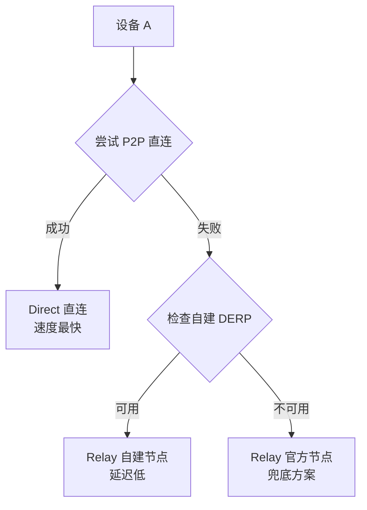
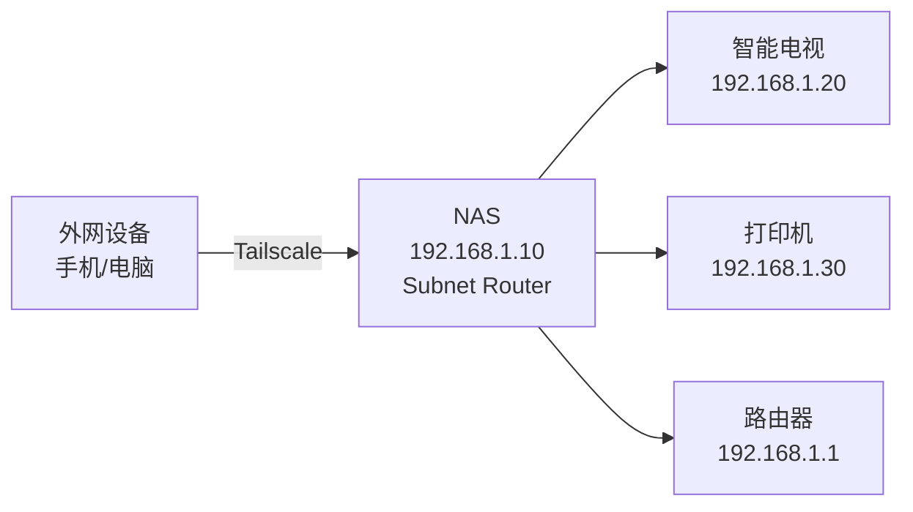

# Tailscale 自建 DERP 中继服务器完全指南

## 📚 目录

- [背景介绍](#背景介绍)
- [适用场景](#适用场景)
- [核心原理](#核心原理)
- [部署前准备](#部署前准备)
- [一键部署脚本](#一键部署脚本)
- [配置阿里云安全组](#配置阿里云安全组)
- [配置 Tailscale ACL](#配置-tailscale-acl)
- [NAS 端安装](#nas-端安装)
- [Subnet Router 配置](#subnet-router-配置)
- [验证与测试](#验证与测试)
- [高级配置](#高级配置)
- [故障排查](#故障排查)
- [维护管理](#维护管理)

---

## 背景介绍

### 什么是 DERP？

DERP (Designated Encrypted Relay for Packets) 是 Tailscale 的中继服务器。当两台设备无法建立 P2P 直连时（例如受限于 NAT、防火墙等），DERP 服务器会作为中继节点转发加密流量。

### 为什么要自建 DERP？

Tailscale 官方的 DERP 服务器主要分布在海外，国内连接存在以下问题：

- **延迟高**：官方最近的节点在东京/新加坡，延迟通常在 100-150ms
- **不稳定**：跨境网络丢包严重，连接质量不佳
- **带宽受限**：官方服务器有使用限制

**自建 DERP 的优势**：

- ✅ **延迟大幅降低**：从 100ms+ 降至 10-30ms（降低 70-90%）
- ✅ **连接更稳定**：国内 VPS 直连，无跨境问题
- ✅ **带宽可控**：根据 VPS 配置自由扩展
- ✅ **隐私性更强**：数据经由自己的服务器中转

---

## 适用场景

本教程特别适合以下场景：

| 场景 | 痛点 | 解决方案 |
|:---|:---|:---|
| **移动宽带 NAS** | IPv4 是大内网，无公网 IP | 通过阿里云 DERP 中继访问 |
| **公司内网设备** | 受防火墙限制，无法打洞 | 中继绕过防火墙 |
| **异地办公** | 官方节点延迟太高 | 自建节点降低延迟 |
| **高频远程访问** | 需要稳定高速的远程连接 | 国内 VPS 保证 QoS |

---

## 核心原理

### 连接优先级

Tailscale 建立连接时的优先级策略：



### 工作流程

1. **设备注册**：NAS/PC 安装 Tailscale 并登录同一账号
2. **打洞尝试**：通过 STUN (UDP 3478) 探测 NAT 类型，尝试 P2P 直连
3. **中继降级**：如果直连失败，自动选择延迟最低的 DERP 节点
4. **流量转发**：DERP 服务器转发加密流量（端到端加密，中继服务器无法解密）

---

## 部署前准备

### 硬件需求

| 资源 | 最低配置 | 推荐配置 | 说明 |
|:---|:---|:---|:---|
| **VPS** | 1核1G | 2核2G | 阿里云/腾讯云轻量应用服务器 |
| **带宽** | 1Mbps | 5Mbps+ | 影响中继速度 |
| **系统** | Ubuntu 20.04+ | Ubuntu 22.04 | 或其他支持 Docker 的 Linux |

### 软件依赖

- Docker（脚本会自动安装）
- OpenSSL（生成证书，系统自带）

### 可选资源

- **域名**：非必需，本教程使用纯 IP 方案
- **SSL 证书**：脚本会自动生成自签名证书

---

## 一键部署脚本

### 脚本说明

该脚本会自动完成以下任务：

1. ✅ 检测 VPS 公网 IP
2. ✅ 安装 Docker（如未安装）
3. ✅ 生成自签名 SSL 证书（有效期 10 年）
4. ✅ 启动 DERP 服务容器
5. ✅ 输出 Tailscale ACL 配置

### 完整脚本

将以下脚本保存为 `deploy_derp.sh`：

```bash
#!/bin/bash
# Tailscale Custom DERP 一键部署脚本 (IP 方案)
# 适用场景：无域名、移动宽带大内网

set -e

echo "======================================"
echo "  Tailscale DERP 一键部署脚本"
echo "======================================"

# 1. 检测公网 IP
PUBLIC_IP=$(curl -s ifconfig.me || curl -s icanhazip.com)
if [ -z "$PUBLIC_IP" ]; then
    echo "[错误] 无法获取公网 IP，请手动指定："
    read -p "请输入您的 VPS 公网 IP: " PUBLIC_IP
fi
echo "[INFO] 检测到公网 IP: $PUBLIC_IP"

# 2. 安装 Docker (如果未安装)
if ! command -v docker &> /dev/null; then
    echo "[INFO] Docker 未安装，正在自动安装..."
    curl -fsSL https://get.docker.com | bash
    systemctl enable docker
    systemctl start docker
    echo "[成功] Docker 安装完成"
else
    echo "[INFO] Docker 已安装，跳过"
fi

# 3. 生成自签名证书
CERT_DIR="/root/derp_certs"
mkdir -p $CERT_DIR
echo "[INFO] 正在生成自签名证书（有效期 10 年）..."
openssl req -x509 -newkey rsa:4096 -sha256 -days 3650 -nodes \
  -keyout $CERT_DIR/derp.key \
  -out $CERT_DIR/derp.crt \
  -subj "/CN=$PUBLIC_IP" \
  -addext "subjectAltName=IP:$PUBLIC_IP" 2>/dev/null
echo "[成功] 证书已生成到: $CERT_DIR"

# 4. 停止旧容器（如果存在）
if [ "$(docker ps -aq -f name=derper)" ]; then
    echo "[INFO] 检测到旧容器，正在清理..."
    docker stop derper 2>/dev/null || true
    docker rm derper 2>/dev/null || true
fi

# 5. 启动 DERP 容器
echo "[INFO] 正在启动 DERP 服务..."
docker run -d \
  --name derper \
  --restart=always \
  -p 33445:443 \
  -p 3478:3478/udp \
  -v $CERT_DIR:/app/certs \
  -e DERP_DOMAIN=$PUBLIC_IP \
  -e DERP_CERT_MODE=manual \
  -e DERP_ADDR=:443 \
  -e DERP_HTTP_PORT=-1 \
  -e DERP_VERIFY_CLIENTS=false \
  fredliang/derper:latest

# 6. 等待容器启动
sleep 3
if [ "$(docker ps -q -f name=derper)" ]; then
    echo ""
    echo "======================================"
    echo "  ✅ DERP 服务部署成功！"
    echo "======================================"
    echo ""
    echo "📌 下一步操作："
    echo ""
    echo "1. 在阿里云控制台开放以下端口："
    echo "   - TCP 33445 (入方向)"
    echo "   - UDP 3478  (入方向)"
    echo ""
    echo "2. 复制以下配置到 Tailscale ACL："
    echo ""
    echo "================================================"
    cat <<EOF
{
  "derpMap": {
    "OmitDefaultRegions": false,
    "Regions": {
      "900": {
        "RegionID": 900,
        "RegionCode": "aliyun",
        "RegionName": "Aliyun Custom",
        "Nodes": [
          {
            "Name": "900a",
            "RegionID": 900,
            "HostName": "$PUBLIC_IP",
            "IPv4": "$PUBLIC_IP",
            "DERPPort": 33445,
            "InsecureForTests": true
          }
        ]
      }
    }
  }
}
EOF
    echo "================================================"
    echo ""
    echo "📝 保存到文件（可选）："
    echo "配置已保存到: $CERT_DIR/tailscale_acl.json"
    
    # 保存 ACL 配置
    cat > $CERT_DIR/tailscale_acl.json <<EOF
{
  "derpMap": {
    "OmitDefaultRegions": false,
    "Regions": {
      "900": {
        "RegionID": 900,
        "RegionCode": "aliyun",
        "RegionName": "Aliyun Custom",
        "Nodes": [
          {
            "Name": "900a",
            "RegionID": 900,
            "HostName": "$PUBLIC_IP",
            "IPv4": "$PUBLIC_IP",
            "DERPPort": 33445,
            "InsecureForTests": true
          }
        ]
      }
    }
  }
}
EOF
    
    echo ""
    echo "🔍 查看日志: docker logs -f derper"
    echo "🔄 重启服务: docker restart derper"
    echo "🛑 停止服务: docker stop derper"
else
    echo "[错误] 容器启动失败，请检查 Docker 日志: docker logs derper"
    exit 1
fi
```

### 使用方法

```bash
# SSH 连接到 VPS

# 创建脚本文件
vim deploy_derp.sh
# 粘贴上面的脚本内容，保存退出

# 赋予执行权限
chmod +x deploy_derp.sh

# 运行脚本
./deploy_derp.sh
```

### 脚本参数说明

| 参数 | 默认值 | 说明 | 是否可改 |
|:---|:---|:---|:---|
| **端口 33445** | TCP 33445 | HTTPS 中继端口 | ✅ 可改（需同步修改 ACL） |
| **端口 3478** | UDP 3478 | STUN 标准端口 | ❌ 不建议改 |
| **证书有效期** | 3650 天 | 10 年 | ✅ 可改 |
| **区域 ID** | 900 | 自定义区域标识 | ✅ 可改（900-999） |

---

## 配置阿里云安全组

### 操作步骤

1. 登录 **阿里云控制台**
2. 进入 **云服务器 ECS** → **网络与安全** → **安全组**
3. 选择您的 VPS 所在安全组，点击 **配置规则**
4. 点击 **入方向** → **手动添加**

### 规则配置

添加以下两条规则：

| 规则方向 | 授权策略 | 协议类型 | 端口范围 | 授权对象 | 描述 |
|:---|:---|:---|:---|:---|:---|
| 入方向 | 允许 | 自定义 TCP | **33445** | `0.0.0.0/0` | Tailscale DERP 中继 |
| 入方向 | 允许 | 自定义 UDP | **3478** | `0.0.0.0/0` | STUN 打洞协议 |

### 授权对象说明

- **`0.0.0.0/0`**：允许所有 IP 访问（推荐，方便您在任何地方连接）
- **特定网段**：如 `111.222.0.0/16`（限制特定 ISP 或公司网段）
  - `/32`：单个 IP（如 `1.2.3.4/32`）
  - `/24`：256 个 IP（如 `1.2.3.0/24`）
  - `/16`：65536 个 IP（如 `1.2.0.0/16`）

**建议**：初期使用 `0.0.0.0/0` 方便测试，确认无误后可根据需要缩小范围。

---

## 配置 Tailscale ACL

### 什么是 ACL？

ACL (Access Control List) 是 Tailscale 的总配置文件，用于控制：
- 设备间的访问权限
- **自定义 DERP 服务器列表**（本教程重点）

### 操作步骤

#### 1. 打开 ACL 编辑器

访问：https://login.tailscale.com/admin/acls

登录您的 Tailscale 账号。

#### 2. 切换到 JSON 编辑器

页面顶部有两个标签：
- **Visual editor**（可视化编辑器）
- **JSON editor**（JSON 编辑器）← **点击这个**

#### 3. 插入 derpMap 配置

在 JSON 编辑器中，您会看到类似这样的内容：

```jsonc
{
  "grants": [ ... ],
  "ssh": [ ... ]
}
```

**在最外层 `{` 后面**插入 `derpMap` 配置（从脚本输出或 VPS 上的 `/root/derp_certs/tailscale_acl.json` 复制）。

### 完整示例

```jsonc
{
  // ========================================
  // 🚀 自定义 DERP 服务器配置
  // ========================================
  "derpMap": {
    "OmitDefaultRegions": false,  // false=保留官方节点作为备用
    "Regions": {
      "900": {
        "RegionID": 900,
        "RegionCode": "aliyun",
        "RegionName": "Aliyun Custom",
        "Nodes": [
          {
            "Name": "900a",
            "RegionID": 900,
            "HostName": "YOUR_VPS_IP",    // ← 改成您的 VPS 公网 IP
            "IPv4": "YOUR_VPS_IP",        // ← 改成您的 VPS 公网 IP
            "DERPPort": 33445,
            "InsecureForTests": true      // IP 方案必须设为 true
          }
        ]
      }
    }
  },
  // ← 注意这里的逗号！

  // ========================================
  // 以下是原有配置，保持不变
  // ========================================
  "grants": [
    {"src": ["*"], "dst": ["*"], "ip": ["*"]},
  ],
  
  "ssh": [
    {
      "action": "check",
      "src": ["autogroup:member"],
      "dst": ["autogroup:self"],
      "users": ["autogroup:nonroot", "root"],
    },
  ],
}
```

### 关键参数说明

| 参数 | 值 | 说明 |
|:---|:---|:---|
| **OmitDefaultRegions** | `false` | 保留官方节点（推荐）<br/>`true` = 只用自建节点 |
| **RegionID** | `900` | 自定义区域 ID（900-999） |
| **HostName** | 您的 IP | VPS 公网 IP 地址 |
| **DERPPort** | `33445` | 中继端口（与脚本一致） |
| **InsecureForTests** | `true` | IP 方案必须开启<br/>域名方案可设为 `false` |

### 🚀 快速复制版本（只需替换 IP）

如果您的 ACL 是默认配置，可以直接使用以下完整模板（**记得把两处 `YOUR_VPS_IP` 改成您的真实 IP**）：

```jsonc
// Example/default ACLs for unrestricted connections.
{
	// ========================================
	// 🚀 自定义 DERP 服务器配置（新增部分）
	// ========================================
	"derpMap": {
		"OmitDefaultRegions": false,
		"Regions": {
			"900": {
				"RegionID": 900,
				"RegionCode": "aliyun",
				"RegionName": "Aliyun Custom",
				"Nodes": [
					{
						"Name": "900a",
						"RegionID": 900,
						"HostName": "YOUR_VPS_IP",        // ← 改成您的 VPS 公网 IP
						"IPv4": "YOUR_VPS_IP",            // ← 改成您的 VPS 公网 IP
						"DERPPort": 33445,
						"InsecureForTests": true
					}
				]
			}
		}
	},
	// ========================================
	// 以下是原有配置，保持不变
	// ========================================

	// Declare static groups of users. Use autogroups for all users or users with a specific role.
	// "groups": {
	//  	"group:example": ["alice@example.com", "bob@example.com"],
	// },

	// Define the tags which can be applied to devices and by which users.
	// "tagOwners": {
	//  	"tag:example": ["autogroup:admin"],
	// },

	// Define grants that govern access for users, groups, autogroups, tags,
	// Tailscale IP addresses, and subnet ranges.
	"grants": [
		// Allow all connections.
		// Comment this section out if you want to define specific restrictions.
		{"src": ["*"], "dst": ["*"], "ip": ["*"]},

		// Allow users in "group:example" to access "tag:example", but only from
		// devices that are running macOS and have enabled Tailscale client auto-updating.
		// {"src": ["group:example"], "dst": ["tag:example"], "ip": ["*"], "srcPosture":["posture:autoUpdateMac"]},
	],

	// Define postures that will be applied to all rules without any specific
	// srcPosture definition.
	// "defaultSrcPosture": [
	//      "posture:anyMac",
	// ],

	// Define device posture rules requiring devices to meet
	// certain criteria to access parts of your system.
	// "postures": {
	//      // Require devices running macOS, a stable Tailscale
	//      // version and auto update enabled for Tailscale.
	// 	"posture:autoUpdateMac": [
	// 	    "node:os == 'macos'",
	// 	    "node:tsReleaseTrack == 'stable'",
	// 	    "node:tsAutoUpdate",
	// 	],
	//      // Require devices running macOS and a stable
	//      // Tailscale version.
	// 	"posture:anyMac": [
	// 	    "node:os == 'macos'",
	// 	    "node:tsReleaseTrack == 'stable'",
	// 	],
	// },

	// Define users and devices that can use Tailscale SSH.
	"ssh": [
		// Allow all users to SSH into their own devices in check mode.
		// Comment this section out if you want to define specific restrictions.
		{
			"action": "check",
			"src":    ["autogroup:member"],
			"dst":    ["autogroup:self"],
			"users":  ["autogroup:nonroot", "root"],
		},
	],

	// Test access rules every time they're saved.
	// "tests": [
	//  	{
	//  		"src": "alice@example.com",
	//  		"accept": ["tag:example"],
	//  		"deny": ["100.101.102.103:443"],
	//  	},
	// ],
}
```

#### 4. 保存配置

点击右上角的 **Save** 按钮。

- ✅ 成功：显示绿色提示 "ACL updated successfully"
- ❌ 失败：会立即报错（格式问题），不会保存，很安全

#### 5. 等待配置生效

保存后，Tailscale 会在 **1-2 分钟内**自动推送配置到所有设备。

---

## NAS 端安装

### 群晖 NAS

1. 打开 **套件中心**
2. 搜索 **Tailscale**
3. 点击 **安装**
4. 安装完成后打开，登录您的 Tailscale 账号

### 威联通 NAS

1. 打开 **App Center**
2. 搜索 **Tailscale**
3. 安装并登录

### 通用 Linux NAS

SSH 连接到 NAS，运行：

```bash
# 安装 Tailscale
curl -fsSL https://tailscale.com/install.sh | sh

# 启动并登录
tailscale up

# 查看分配的 IP
tailscale ip -4
```

---

## Subnet Router 配置

### 什么是 Subnet Router（子网路由）？

**Subnet Router** 允许您通过 Tailscale 网络中的一台设备（如 NAS）作为"跳板"，访问该设备所在局域网的**其他设备**（即使这些设备没有安装 Tailscale）。

### 典型场景

假设您的家庭网络是 `192.168.1.0/24`：
- NAS: `192.168.1.10`（已安装 Tailscale）
- 智能电视: `192.168.1.20`（没有安装 Tailscale）
- 打印机: `192.168.1.30`（没有安装 Tailscale）

配置 Subnet Router 后，您在外网（如公司、咖啡厅）可以通过 Tailscale 直接访问 `192.168.1.20` 和 `192.168.1.30`，就像在家里一样。

### 原理图



### 配置步骤

#### 步骤 1：在 NAS 上启用 Subnet Router

SSH 连接到 NAS，运行：

```bash
# 查看 NAS 所在网段（假设是 192.168.1.0/24）
ip addr | grep inet

# 启用 Subnet Router（广播子网路由）
tailscale up --advertise-routes=192.168.1.0/24 --accept-routes
```

**参数说明**：
- `--advertise-routes=192.168.1.0/24`：告诉 Tailscale "我可以转发 192.168.1.0/24 这个网段的流量"
- `--accept-routes`：允许接收其他设备广播的路由（可选，但建议加上）

**多网段示例**：

如果您有多个网段（如 NAS 连了两个网络），可以用逗号分隔：

```bash
tailscale up --advertise-routes=192.168.1.0/24,10.0.0.0/24 --accept-routes
```

#### 步骤 2：在 Tailscale 控制台批准路由

1. 打开 https://login.tailscale.com/admin/machines
2. 找到您的 NAS 设备
3. 点击设备右侧的 **"..."** 菜单 → **Edit route settings**
4. 您会看到 NAS 请求广播的路由（如 `192.168.1.0/24`）
5. **勾选批准** → **Save**

#### 步骤 3：在其他设备上启用路由接收

在您的 PC/手机上（需要访问 NAS 局域网的设备），确保启用了 **Accept routes**。

**Windows**：

```powershell
tailscale up --accept-routes
```

**macOS/Linux**：

```bash
sudo tailscale up --accept-routes
```

**Android/iOS**：

1. 打开 Tailscale App
2. 设置 → **Use subnet routes** → 开启

#### 步骤 4：验证

在外网环境下，尝试 ping NAS 局域网内的设备：

```bash
# 假设您的智能电视是 192.168.1.20
ping 192.168.1.20

# 或者访问路由器管理页面
http://192.168.1.1
```

如果能 ping 通或访问，说明 Subnet Router 配置成功！

### 高级配置

#### 1. 只允许特定设备访问子网

默认情况下，Tailnet 内的所有设备都可以访问您的子网。如果想限制只有特定设备可以访问，修改 ACL：

```jsonc
{
  "grants": [
    // 只允许您的电脑访问 NAS 的子网
    {
      "src": ["your-pc@example.com"],
      "dst": ["192.168.1.0/24"],
      "ip": ["*"]
    },
  ]
}
```

#### 2. 启用 IP 转发（Linux NAS）

某些 Linux 系统需要手动开启 IP 转发才能让 Subnet Router 正常工作：

```bash
# 临时开启（重启后失效）
echo 'net.ipv4.ip_forward = 1' | sudo tee -a /etc/sysctl.d/99-tailscale.conf
echo 'net.ipv6.conf.all.forwarding = 1' | sudo tee -a /etc/sysctl.d/99-tailscale.conf
sudo sysctl -p /etc/sysctl.d/99-tailscale.conf

# 永久开启
sudo sed -i 's/#net.ipv4.ip_forward=1/net.ipv4.ip_forward=1/' /etc/sysctl.conf
sudo sysctl -p
```

#### 3. 查看路由状态

```bash
# 查看当前广播的路由
tailscale status

# 输出示例：
# 100.64.1.23   nas    user@  linux  relay "aliyun"
#   offers exit node, routes: 192.168.1.0/24
```

### 常见问题

**Q1: 配置后 ping 不通局域网设备？**

A: 检查以下几点：
1. Tailscale 控制台是否批准了路由
2. 客户端是否启用了 `--accept-routes`
3. NAS 的防火墙是否允许转发
4. Linux NAS 是否开启了 IP 转发

**Q2: 局域网设备能访问，但速度很慢？**

A: 可能是在走中继。检查 NAS 与客户端之间能否 P2P 直连：
```bash
tailscale status
# 如果显示 "relay"，尝试优化网络环境（开启 IPv6、端口转发等）
```

**Q3: 子网路由会影响已有的 VPN 吗？**

A: 不会。Tailscale 的路由是叠加的，不会影响您已有的 VPN 或公司网络。

**Q4: 可以同时广播多个网段吗？**

A: 可以。用逗号分隔即可：
```bash
tailscale up --advertise-routes=192.168.1.0/24,10.0.0.0/24
```

---

## 验证与测试

### 1. 客户端验证

在 **Windows/macOS** 上运行：

```bash
tailscale netcheck
```

**成功标志**：

```text
* Nearest DERP: Aliyun Custom
* DERP latency:
    - aliyun: 12.3ms  (Aliyun Custom)  ← 您的节点，延迟最低
    - hkg: 69.1ms      (Hong Kong)
    - tok: 104.4ms     (Tokyo)
```

### 2. 强制刷新配置

如果看不到 `aliyun` 节点，尝试重启 Tailscale：

**Windows**：

```powershell
# 管理员权限 PowerShell
net stop Tailscale
Start-Sleep -Seconds 3
net start Tailscale
Start-Sleep -Seconds 5
tailscale netcheck
```

**macOS/Linux**：

```bash
sudo systemctl restart tailscaled
sleep 5
tailscale netcheck
```

### 3. 连接测试

查看设备连接状态：

```bash
tailscale status
```

输出示例：

```text
100.64.1.10   your-pc          user@     linux   -
100.64.1.23   nas              user@     linux   relay "aliyun"
```

- **`direct`**：P2P 直连（最快）
- **`relay "aliyun"`**：走您的自建节点
- **`relay "tok"`**：走官方东京节点（一般不应该出现）

### 4. 端口连通性测试

在本地电脑测试能否连接到 VPS：

```powershell
# Windows PowerShell（把 YOUR_VPS_IP 换成真实 IP）
Test-NetConnection -ComputerName YOUR_VPS_IP -Port 33445
```

应显示 `TcpTestSucceeded : True`。

---

## 高级配置

### 1. 禁用官方节点（纯自建）

如果想强制所有流量只走自建节点：

```jsonc
"derpMap": {
  "OmitDefaultRegions": true,  // ← 改为 true
  "Regions": { ... }
}
```

**优点**：

- 延迟最低（所有中继都走自建）
- 流量可控（方便监控）

**缺点**：

- 单点故障（VPS 挂了就连不上）
- 带宽压力大（所有设备的流量压在一台 VPS）

### 2. 启用客户端验证

防止陌生人连接您的 DERP（虽然概率极低）：

修改脚本第 47 行：

```bash
-e DERP_VERIFY_CLIENTS=true \  # ← 改为 true
```

**但需额外步骤**：

在 VPS 上也安装 Tailscale 并登录：

```bash
curl -fsSL https://tailscale.com/install.sh | sh
tailscale up
```

### 3. 自定义端口

如果 33445 端口被占用，可以改成其他高位端口：

1. **修改脚本第 43 行**：
   ```bash
   -p 44445:443 \  # ← 改成您想要的端口
   ```

2. **同步修改 ACL**：
   ```jsonc
   "DERPPort": 44445,  // ← 与脚本一致
   ```

3. **更新安全组规则**：
   ```
   TCP 44445 (入方向)
   ```

### 4. 域名方案（可选）

如果您有域名（如 `derp.example.com`）：

1. **申请 SSL 证书**（阿里云/腾讯云免费证书）
2. **下载 Nginx 格式证书**（`.key` 和 `.crt`）
3. **上传到 VPS**：
   ```bash
   /root/certs/derp.example.com.key
   /root/certs/derp.example.com.crt
   ```
4. **修改脚本**：
   ```bash
   -e DERP_DOMAIN=derp.example.com \  # ← 域名
   ```
5. **修改 ACL**：
   ```jsonc
   "HostName": "derp.example.com",
   "InsecureForTests": false,  // ← 域名可设为 false
   ```

---

## 故障排查

### 问题 1：`tailscale netcheck` 看不到 `aliyun`

**可能原因**：

- ✅ ACL 配置未保存成功
- ✅ 客户端缓存了旧配置

**解决方案**：

1. 确认 ACL 保存成功（网页控制台查看）
2. 重启 Tailscale 客户端
3. 等待 2-5 分钟再测试

### 问题 2：显示 `aliyun` 但延迟很高

**可能原因**：

- VPS 网络质量差
- 安全组规则未生效

**解决方案**：

```bash
# 在 VPS 上检查容器状态
docker ps -a | grep derper

# 查看日志
docker logs derper --tail 50

# 确认端口监听
netstat -tulnp | grep -E '33445|3478'
```

### 问题 3：提示 "No DERP map from tailscaled"

**原因**：客户端未从服务器获取配置

**解决方案**：

```bash
# 强制重启 Tailscale 服务
sudo systemctl restart tailscaled  # Linux/macOS
net stop Tailscale && net start Tailscale  # Windows
```

### 问题 4：ACL 保存失败

**可能原因**：JSON 格式错误

**解决方案**：

1. 复制整个 ACL 配置
2. 访问 https://jsonlint.com/ 验证格式
3. 常见错误：
   - 缺少逗号（如 `derpMap` 后面）
   - 括号未配对
   - IP 地址未加引号

### 问题 5：容器启动失败

```bash
# 查看详细错误
docker logs derper

# 常见问题：
# - 证书路径不对：检查 /root/derp_certs 是否存在
# - 端口被占用：改用其他端口
# - 权限问题：确保以 root 运行脚本
```

---

## 维护管理

### 日常管理命令

```bash
# 查看容器状态
docker ps -a | grep derper

# 查看实时日志
docker logs -f derper

# 查看最近 100 行日志
docker logs derper --tail 100

# 重启容器
docker restart derper

# 停止容器
docker stop derper

# 删除容器（重新部署时）
docker rm -f derper
```

### 流量监控

查看 VPS 流量使用：

```bash
# 安装 vnstat
apt install vnstat -y

# 查看流量统计
vnstat -l  # 实时流量
vnstat -d  # 按天统计
```

### 证书续期

自签名证书有效期 10 年，到期前重新生成：

```bash
cd /root/derp_certs

# 重新生成证书
openssl req -x509 -newkey rsa:4096 -sha256 -days 3650 -nodes \
  -keyout derp.key \
  -out derp.crt \
  -subj "/CN=YOUR_VPS_IP" \
  -addext "subjectAltName=IP:YOUR_VPS_IP"

# 重启容器
docker restart derper
```

### 备份配置

建议定期备份关键文件：

```bash
# 备份证书
cp -r /root/derp_certs /backup/

# 备份 ACL 配置（从网页控制台导出）
```

### 升级容器

更新到最新版镜像：

```bash
# 拉取最新镜像
docker pull fredliang/derper:latest

# 删除旧容器
docker rm -f derper

# 重新运行部署脚本
./deploy_derp.sh
```

---

## 常见问题 FAQ

### Q1: 需要域名吗？

**A**: 不需要。本教程使用纯 IP 方案，脚本会自动生成自签名证书。

### Q2: 安全吗？

**A**: 非常安全。虽然 ACL 里设置了 `InsecureForTests: true`，但这只是跳过了 DERP 服务器的证书验证。您的端到端流量依然由 Tailscale 的 WireGuard 协议加密，中继服务器无法解密数据。

### Q3: 流量费用大概多少？

**A**: 阿里云按量付费约 0.8 元/GB。如果只是传文档、SSH 等轻量操作，每月几元即可。如果频繁传输大文件或看视频，建议优化网络环境让设备尽量走 P2P 直连。

### Q4: 可以多台 VPS 组成集群吗？

**A**: 可以。在 ACL 的 `Regions` 里添加多个节点：

```jsonc
"Regions": {
  "900": {
    "Nodes": [
      {"Name": "900a", "HostName": "VPS1_IP", ...},
      {"Name": "900b", "HostName": "VPS2_IP", ...}
    ]
  }
}
```

Tailscale 会自动选择延迟最低的节点。

### Q5: IPv6 环境下会用到 DERP 吗？

**A**: 如果双方都有公网 IPv6，Tailscale 会优先 P2P 直连，不经过 DERP。DERP 只在直连失败时作为备选方案。

### Q6: 可以给朋友用吗？

**A**: 可以。默认配置 `DERP_VERIFY_CLIENTS=false` 允许任何同一 Tailnet 的设备使用。如果设为 `true`，则只有 VPS 本身登录的 Tailnet 成员可用。

---

## 参考资料

- [Tailscale 官方文档 - Custom DERP](https://tailscale.com/kb/1118/custom-derp-servers/)
- [fredliang/derper - Docker Hub](https://hub.docker.com/r/fredliang/derper)
- [Tailscale DERP 源码](https://github.com/tailscale/tailscale/tree/main/cmd/derper)

---

## 总结

通过本教程，您已经成功搭建了一个高性能的 Tailscale 自建 DERP 中继服务器。核心优势：

- ✅ **延迟降低 70-90%**（100ms+ → 10-30ms）
- ✅ **连接稳定可靠**（国内 VPS 直连）
- ✅ **完全自主可控**（带宽、隐私、成本）
- ✅ **一键部署维护**（脚本自动化）

现在您可以随时随地高速访问您的 NAS 和内网设备了！

---

**文档版本**: v1.0  
**最后更新**: 2026-02-06  
**维护者**: FenLynn
