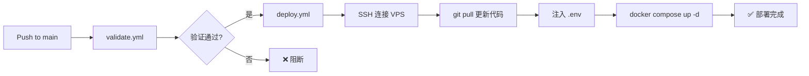

# 🚀 VPS-OPS v2.0 升级方案：DMZ 无状态云端堡垒机

> 基于 `gemini_design.md` 蓝图与现有 `vps-ops` 仓库框架的完整升级方案。
> 主域名：`660415.xyz`

---

## 🎯 一、升级目标总览

### 现有架构 (v1.0) → 升级架构 (v2.0) 核心差异

| 维度 | v1.0 (当前) | v2.0 (目标) |
|:---|:---|:---|
| **部署路径** | `/nfs/docker` 分散挂载 | `/opt/vps-dmz/` 统一根目录，四面隔离 |
| **目录哲学** | 按 Layer 分 Compose 文件 | 代码/配置/数据/日志 四维隔离 |
| **服务范围** | new-api、derper、uptime-kuma、dockge、homarr | 新增 music-api、unblock-netease、nginx-relay、FastAPI 网关 |
| **域名体系** | 未规范 | `660415.xyz` 统一二级域名规范 |
| **备份** | Kopia 内置 cron 循环 | 独立 `backup_kopia.sh`，含 SQLite 原子性保护 |
| **CI/CD** | Docker Image Sync + Validate | 新增 SSH 自动部署 workflow |
| **网络** | `vps-net` 扁平桥接 | `vps_tunnel_net` 严格隔离 + DERP host 例外 |

### 域名规划 (Cloudflare Tunnel 路由)

| 二级域名 | 服务 | 容器内部地址 | 说明 |
|:---|:---|:---|:---|
| `new-api.660415.xyz` | New API (AI 网关) | `http://new-api:3000` | AI 接口管理 |
| `music-api.660415.xyz` | YesPlayMusic 后端 | `http://music-api:3000` | 音乐 API 后端 |
| `api.660415.xyz` | FastAPI 统一调度 | `http://fastapi-gateway:8000` | 统一 API 网关 |
| `status.660415.xyz` | Uptime Kuma | `http://uptime-kuma:3001` | 监控面板 |
| `music.660415.xyz` | YesPlayMusic 前端 | CF Pages 静态托管 | 不走 Tunnel |
| `webhook.660415.xyz` | nginx-relay → NAS | `http://nginx-relay:80` | Webhook 转发到家庭 NAS |
| `dockge.660415.xyz` | Dockge 容器管理 | `http://dockge:5001` | 管理面板 (Access 保护) |
| `home.660415.xyz` | Homarr 仪表盘 | `http://homarr:7575` | 导航页 (Access 保护) |
| `derp.660415.xyz` | DERP 直连 | 物理端口 TCP:33445/UDP:3478 | 不走 Tunnel，直连 |

---

## 🏗️ 二、仓库目录结构设计

### 2.1 Git 仓库结构（本地开发 & GitHub）

```text
vps-ops/                          # Git 仓库根目录
├── .github/
│   └── workflows/
│       ├── validate.yml          # [修改] 增加新 Compose 文件验证
│       ├── docker-sync.yml       # [保留] 镜像同步
│       └── deploy.yml            # [新增] SSH 推送部署到 VPS
├── .githooks/                    # [保留] pre-commit + prepare-commit-msg
├── compose/                      # [新增] 替代原 00-infra/01-stable/02-management
│   ├── docker-compose.yml        # [新增] 唯一核心编排文件(所有服务)
│   └── docker-compose.dev.yml    # [新增] 可选的本地调试覆盖
├── config/                       # [新增] 静态配置文件（只读挂载到容器）
│   ├── nginx-relay/
│   │   └── nginx.conf            # Nginx 反代规则
│   └── fastapi-gateway/
│       └── main.py               # FastAPI 网关入口
├── scripts/                      # [修改] 运维脚本目录
│   ├── init_host.sh              # [重写] 裸机初始化 + 灾备恢复
│   ├── backup_kopia.sh           # [新增] 原子性备份脚本
│   ├── cert_renew.sh             # [新增] 证书续期 + DERP 重启
│   └── prune.sh                  # [保留] Docker 清理
├── presets/                      # [保留] 自定义 bashrc 和 vimrc
│   ├── bashrc.append
│   └── .vimrc
├── docs/                         # [保留] 文档目录
├── .env.example                  # [修改] 新增环境变量
├── .gitignore                    # [修改] 补充排除项
├── config.ini                    # [修改] 新增网络名和路径配置
├── README.md                     # [修改] 更新文档
├── plan.md                       # 本文件
├── gemini_design.md              # 设计蓝图参考
├── CHANGELOG.md                  # [修改] 追加 v2.0 记录
└── SECURITY.md                   # [保留]
```

### 2.2 VPS 宿主机运行时目录（部署后）

```text
/opt/vps-dmz/                    # 宿主机运行根目录
├── docker-compose.yml           # 从 Git 仓库同步而来
├── .env                         # CI/CD 注入或手动创建（不入 Git）
├── scripts/                     # 运维脚本
│   ├── init_host.sh
│   ├── backup_kopia.sh
│   ├── cert_renew.sh
│   └── prune.sh
├── config/                      # 静态配置（只读挂载）
│   ├── nginx-relay/
│   │   └── nginx.conf
│   └── fastapi-gateway/
│       └── main.py
├── data/                        # 🌟 核心状态数据（Kopia 备份目标）
│   ├── acme/                    # SSL 证书存储 (DERP)
│   ├── new-api/                 # SQLite 主数据库
│   ├── uptime-kuma/             # 监控数据库
│   └── kopia-cache/             # 备份缓存
└── logs/                        # 🚫 日志数据（严禁备份）
    ├── new-api/                 # API 日志 DB
    └── nginx/                   # 访问日志
```

> **核心原则**：Git 仓库是"声明式蓝图"，VPS 是"运行时实例"。`data/` 和 `logs/` 仅存在于 VPS，永远不入 Git。

---

## 🧩 三、核心文件设计详解

### 3.1 `docker-compose.yml` — 统一编排（替代三文件分层）

**设计决策**：将原来的三个 `docker-compose.yml`（`00-infra/`、`01-stable/`、`02-management/`）合并为一个统一文件。原因：
1. `gemini_design.md` 明确要求"唯一核心编排文件"
2. 使用 `depends_on` + `profiles` 实现启动顺序控制，比手动 `cd` 各目录更可靠
3. 方便 CI/CD 统一 `docker compose up -d`

**服务清单**：

| 服务名 | 镜像 | 网络 | 端口暴露 | 依赖 |
|:---|:---|:---|:---|:---|
| `cloudflared` | `cloudflare/cloudflared` | `vps_tunnel_net` | 🚫 无 | 无 |
| `acme` | `neilpang/acme.sh` | host | 🚫 无 | 无 |
| `acme-init` | `neilpang/acme.sh` | host | 🚫 无 | acme |
| `watchtower` | `containrrr/watchtower` | 无（sock 挂载） | 🚫 无 | 无 |
| `derper` | `fredliang/derper` | host 或端口映射 | ✅ TCP:33445 + UDP:3478 | acme-init |
| `new-api` | `calciumion/new-api` | `vps_tunnel_net` | 🚫 无 | cloudflared |
| `music-api` | YesPlayMusic 后端镜像 | `vps_tunnel_net` | 🚫 无 | unblock-netease |
| `unblock-netease` | 解灰代理镜像 | `vps_tunnel_net` | 🚫 无 | 无 |
| `nginx-relay` | `nginx:alpine` | `vps_tunnel_net` | 🚫 无 | cloudflared |
| `fastapi-gateway` | 自建/Python 镜像 | `vps_tunnel_net` | 🚫 无 | cloudflared |
| `uptime-kuma` | `louislam/uptime-kuma` | `vps_tunnel_net` | 🚫 无 | 无 |
| `kopia` | `kopia/kopia` | 无 | 🚫 无 | 无 |
| `dockge` | `louislam/dockge` | `vps_tunnel_net` | 🚫 无 | 无 |
| `homarr` | `ajnart/homarr` | `vps_tunnel_net` | 🚫 无 | 无 |

**内部网络定义**：
```yaml
networks:
  vps_tunnel_net:
    name: vps_tunnel_net
    driver: bridge
```

**关键卷挂载约定**（以 `/opt/vps-dmz` 为基础路径，通过 `.env` 中 `BASE_DIR` 变量控制）：

| 容器 | 挂载源 | 挂载目标 | 模式 |
|:---|:---|:---|:---|
| `new-api` | `${BASE_DIR}/data/new-api` | `/data` | rw |
| `new-api` (日志) | `${BASE_DIR}/logs/new-api` | `/logs` | rw |
| `uptime-kuma` | `${BASE_DIR}/data/uptime-kuma` | `/app/data` | rw |
| `acme` / `acme-init` | `${BASE_DIR}/data/acme` | `/acme.sh` | rw |
| `derper` | `${BASE_DIR}/data/acme/${DERP_DOMAIN}` | `/app/certs` | ro |
| `nginx-relay` | `${BASE_DIR}/config/nginx-relay/nginx.conf` | `/etc/nginx/nginx.conf` | ro |
| `fastapi-gateway` | `${BASE_DIR}/config/fastapi-gateway` | `/app` | ro |
| `kopia` | `${BASE_DIR}/data` | `/source` | rw |
| `kopia` (日志排除) | - | - | 不挂载 `logs/` |
| `dockge` | `/var/run/docker.sock` | `/var/run/docker.sock` | rw |
| `homarr` | `/var/run/docker.sock` | `/var/run/docker.sock` | ro |

### 3.2 `init_host.sh` — 裸机初始化脚本（重写）

在现有 `init_host.sh` 基础上增加/修改以下功能：

1. **目录结构创建**：`mkdir -p` 所有 `/opt/vps-dmz/{data,logs,config,scripts}` 子目录
2. **权限修正**：`chown -R 1000:1000 /opt/vps-dmz/data /opt/vps-dmz/logs`
3. **网络名更新**：从 `vps-net` 改为 `vps_tunnel_net`
4. **Git 仓库克隆**：将代码拉取到 `/opt/vps-dmz/` 并 symlink 配置
5. **Kopia 灾难恢复**：检测是否为全新机器，自动从 WebDAV 拉取最新快照
6. **统一启动**：直接 `docker compose up -d` 一条命令启动全部服务

**保留**的现有功能：
- OS 检测 (Debian/CentOS)
- Docker 安装 (含国内镜像)
- 用户创建 & SSH 密钥迁移
- SSH 加固 (端口、禁 root、禁密码)
- 防火墙配置
- BBR 加速
- Fail2Ban
- Swap 创建
- lazydocker 安装
- 用户 preset 应用

### 3.3 `backup_kopia.sh` — 原子性备份脚本（新增）

严格遵循 `gemini_design.md` 的四步流程：

```text
1. Pre-freeze:   docker pause new-api uptime-kuma
2. Snapshot:     kopia snapshot create /source (仅 data/ 目录，排除 .shm/.wal)
3. Post-thaw:    docker unpause new-api uptime-kuma
4. Maintenance:  kopia snapshot expire + kopia maintenance run
```

**触发方式**：crontab `0 3 * * *`（每天凌晨 3 点）

> **与 v1.0 的区别**：v1.0 的 Kopia 容器内置了一个 `while true` 的 cron 循环，存在容器重启后时间漂移的问题。v2.0 改为宿主机 crontab + 独立脚本，更可靠。

### 3.4 `nginx-relay/nginx.conf` — 公私网桥接（新增）

将从 CF Tunnel 进来的 webhook 请求，通过 Tailscale 内网 (`100.x.x.x`) 转发到家庭 NAS：

```text
webhook.660415.xyz  →  CF Tunnel  →  nginx-relay:80  →  Tailscale 100.x.x.x:port  →  NAS
```

### 3.5 `fastapi-gateway` — 统一 API 网关（新增）

**目的**：`api.660415.xyz` 入口，作为所有 API 请求的统一调度中心。

**路由设计**：

| 路由路径 | 转发目标 | 说明 |
|:---|:---|:---|
| `/v1/chat/*` | `http://new-api:3000/` | 代理到 New API |
| `/music/*` | `http://music-api:3000/` | 代理到音乐 API |
| `/webhook/*` | `http://nginx-relay:80/` | 代理到 NAS |
| `/health` | 本地处理 | 健康检查端点 |
| `/` | 本地处理 | API 文档/状态页 |

**技术选型**：
- 使用 Python FastAPI + `httpx` 做异步反向代理
- Docker 镜像使用 `python:3.12-slim`，pip 安装依赖
- 配置文件挂载，路由规则可动态调整

> **讨论点**：您是否需要 FastAPI 做更多事情（如鉴权、限流、日志聚合），还是仅作为纯路由转发？这会影响方案复杂度。

### 3.6 `cert_renew.sh` — 证书续期脚本（新增）

由 `acme.sh` 容器的 daemon 模式自动续期，续期成功后执行 `docker restart derper` 以加载新证书。

---

## ⚙️ 四、`.env.example` 环境变量规划

在现有变量基础上，新增以下环境变量：

```ini
# ==========================================
# 基础路径
# ==========================================
BASE_DIR=/opt/vps-dmz                 # [新增] 统一根目录

# ==========================================
# 域名体系
# ==========================================
MAIN_DOMAIN=660415.xyz                # [新增] 主域名

# ==========================================
# Cloudflare (现有，保留)
# ==========================================
CF_TOKEN=eyJh...                      # Tunnel Token
CF_DNS_API_TOKEN=...                  # DNS API Token
CLOUDFLARE_ACCOUNT_ID=...            # Account ID

# ==========================================
# DERP (现有，保留)
# ==========================================
DERP_DOMAIN=derp.660415.xyz           # [修改] 更新域名

# ==========================================
# 备份 (现有，保留)
# ==========================================
KOPIA_PASSWORD=...
WEBDAV_URL=https://...
WEBDAV_USER=...
WEBDAV_PASS=...

# ==========================================
# 业务服务 (现有+新增)
# ==========================================
NEW_API_ADMIN_PASSWORD=...            # [保留]
MUSIC_API_IMAGE=...                   # [新增] 音乐 API 镜像地址
UNBLOCK_NETEASE_IMAGE=...             # [新增] 解灰代理镜像

# ==========================================
# FastAPI 网关 (新增)
# ==========================================
FASTAPI_SECRET_KEY=...                # [新增] API 网关密钥
NAS_TAILSCALE_IP=100.x.x.x           # [新增] NAS 的 Tailscale IP
NAS_WEBHOOK_PORT=5678                 # [新增] NAS n8n 端口

# ==========================================
# 通知与监控 (现有，保留)
# ==========================================
PUSHPLUS_TOKEN=...
WATCHTOWER_NOTIFICATION_URL=...

# ==========================================
# 其他 (现有，保留)
# ==========================================
TAILSCALE_AUTH_KEY=tskey-...
GH_TOKEN=ghp_...
ADMIN_PASS=...
```

---

## 🔐 五、GitHub Secrets 配置清单

以下 Secrets 需要在 GitHub 仓库的 **Settings → Secrets and variables → Actions** 中添加：

| Secret 名称 | 用途 | 来源 | 是否已有 |
|:---|:---|:---|:---|
| `VPS_HOST` | VPS 的公网 IP 或域名 | 您的 VPS 提供商 | ❌ 新增 |
| `VPS_SSH_PORT` | SSH 端口 (22222) | `config.ini` | ❌ 新增 |
| `VPS_SSH_KEY` | SSH 私钥（Base64 编码） | 本地 `~/.ssh/id_rsa` | ❌ 新增 |
| `VPS_USER` | SSH 用户名 (`sudor`) | `config.ini` | ❌ 新增 |
| `DEPLOY_ENV_FILE` | 完整 `.env` 文件内容 | 本地 `.env` | ❌ 新增 |
| `GITHUB_TOKEN` | GitHub Actions 内置 Token | 自动提供 | ✅ 已有 |

### CI/CD 部署流程



**`deploy.yml` 工作流设计**：
1. SSH 连接到 VPS
2. `cd /opt/vps-dmz && git pull`
3. 写入 `.env`（从 Secret 注入）
4. `docker compose pull && docker compose up -d --remove-orphans`
5. 健康检查

---

## ☁️ 六、Cloudflare 配置清单

### 6.1 DNS 记录（域名解析由 Tunnel 自动管理，无需手动添加 A/CNAME）

Tunnel 会自动在 DNS 中创建 CNAME 记录指向 `.cfargotunnel.com`。

### 6.2 Zero Trust → Tunnels → Public Hostnames

在 Cloudflare Zero Trust 后台，需要为 Tunnel 配置以下 Public Hostnames：

| Hostname | Service | 备注 |
|:---|:---|:---|
| `new-api.660415.xyz` | `http://new-api:3000` | |
| `music-api.660415.xyz` | `http://music-api:3000` | |
| `api.660415.xyz` | `http://fastapi-gateway:8000` | |
| `status.660415.xyz` | `http://uptime-kuma:3001` | |
| `webhook.660415.xyz` | `http://nginx-relay:80` | |
| `dockge.660415.xyz` | `http://dockge:5001` | ⚠️ 启用 Access 保护 |
| `home.660415.xyz` | `http://homarr:7575` | ⚠️ 启用 Access 保护 |

### 6.3 Access 策略（保护管理面板）

在 Zero Trust → Access → Applications 中，为以下域名创建应用：
- `dockge.660415.xyz`
- `home.660415.xyz`

策略建议：**Email OTP**（用您的常用邮箱接收一次性验证码登录）

### 6.4 WAF 防火墙规则（防盗刷 music-api）

在 `660415.xyz` 域名的 **Security → WAF → Custom rules** 中新建规则：

```
规则名称: Block unauthorized music-api access
表达式: (http.host eq "music-api.660415.xyz") and (not http.referer contains "music.660415.xyz")
动作: Block
```

### 6.5 CF Pages（音乐前端静态托管）

| 设置项 | 值 |
|:---|:---|
| 域名 | `music.660415.xyz` |
| 构建命令 | 视具体前端框架而定 |
| 输出目录 | `dist/` |

---

## 🖥️ 七、VPS 服务器配置清单

### 7.1 初始化步骤

```bash
# 1. 以 root 登录 VPS
ssh root@VPS_IP

# 2. 克隆仓库
git clone https://github.com/FenLynn/vps-ops.git /opt/vps-dmz
cd /opt/vps-dmz

# 3. 创建 .env
cp .env.example .env
nano .env  # 填入所有密钥

# 4. 一键初始化
sudo bash scripts/init_host.sh
```

### 7.2 防火墙端口规划

| 端口 | 协议 | 服务 | 状态 |
|:---|:---|:---|:---|
| 22222 | TCP | SSH | ✅ 开放 |
| 33445 | TCP | DERP 中继 | ✅ 开放 |
| 3478 | UDP | STUN 打洞 | ✅ 开放 |
| 80/443 | TCP | HTTP/HTTPS | 🚫 关闭（全走 Tunnel） |

### 7.3 crontab 定时任务

```cron
# 每天凌晨 3 点执行 Kopia 备份
0 3 * * * /opt/vps-dmz/scripts/backup_kopia.sh >> /opt/vps-dmz/logs/backup.log 2>&1

# 每天凌晨 4 点清理 Docker 垃圾
0 4 * * * /opt/vps-dmz/scripts/prune.sh >> /opt/vps-dmz/logs/prune.log 2>&1
```

### 7.4 Tailscale 配置

```bash
# 安装 Tailscale
curl -fsSL https://tailscale.com/install.sh | sh

# 启动并加入网络
tailscale up --authkey=${TAILSCALE_AUTH_KEY}

# 在 Tailscale 后台:
#   1. 关闭此 VPS 节点的 "Key Expiry"
#   2. 确认 NAS 也在同一 Tailnet 中
```

### 7.5 坚果云 WebDAV 配置

1. 登录坚果云 → 安全选项 → 第三方应用管理
2. 创建应用密码（专用于 Kopia）
3. 在坚果云根目录创建文件夹 `vps-dmz-kopia`
4. WebDAV URL 格式：`https://dav.jianguoyun.com/dav/vps-dmz-kopia`

---

## 📋 八、从 v1.0 → v2.0 的迁移步骤

### 8.1 需要创建的新文件

| 文件 | 说明 |
|:---|:---|
| `compose/docker-compose.yml` | 统一编排文件 |
| `compose/docker-compose.dev.yml` | 可选调试覆盖 |
| `config/nginx-relay/nginx.conf` | Nginx 反代配置 |
| `config/fastapi-gateway/main.py` | FastAPI 网关代码 |
| `config/fastapi-gateway/requirements.txt` | Python 依赖 |
| `config/fastapi-gateway/Dockerfile` | FastAPI 构建文件 |
| `scripts/backup_kopia.sh` | 原子性备份脚本 |
| `scripts/cert_renew.sh` | 证书续期脚本 |
| `.github/workflows/deploy.yml` | SSH 自动部署 |

### 8.2 需要修改的现有文件

| 文件 | 修改内容 |
|:---|:---|
| `init_host.sh` → `scripts/init_host.sh` | 移动位置 + 重写逻辑 |
| `.env.example` | 新增环境变量 |
| `config.ini` | 更新路径和网络名 |
| `.gitignore` | 添加 `data/`、`logs/`、`__pycache__/` 等 |
| `README.md` | 更新文档 |
| `CHANGELOG.md` | 追加 v2.0 |
| `.github/workflows/validate.yml` | 更新路径 |

### 8.3 需要删除/归档的文件

| 文件/目录 | 处理方式 |
|:---|:---|
| `00-infra/docker-compose.yml` | 合并到统一文件后删除 |
| `01-stable/docker-compose.yml` | 合并到统一文件后删除 |
| `02-management/docker-compose.yml` | 合并到统一文件后删除 |
| `index.md` + `mkdocs.yml` | 视情况保留或删除 |

---

## ❓ 九、需要您确认的讨论点

> [!IMPORTANT]
> 以下问题需要您的反馈，将直接影响代码实现细节。

### 1. FastAPI 网关的定位
- **选项 A**：纯路由转发（轻量，类似 Nginx 反代，仅做路径分发）
- **选项 B**：智能网关（鉴权、限流、日志聚合、API 文档聚合）
- **建议**：先实现选项 A，后续按需升级到 B

### 2. music-api 和 unblock-netease 的镜像选择
- 您使用的是哪个 YesPlayMusic 后端镜像？（`nondanee/unblockneteasemusic`？自建？）
- 前端是否已经部署在 CF Pages？

### 3. 旧目录结构如何迁移
- **选项 A**：直接删除 `00-infra/`、`01-stable/`、`02-management/` 三个目录
- **选项 B**：保留为归档 (archive)，新建 `compose/` 目录
- **建议**：选项 A，Git 历史中保留了记录

### 4. Kopia 备份容器 vs 宿主机脚本
- v1.0 用的是 Kopia Docker 容器（内置 cron 循环）
- `gemini_design.md` 建议改为宿主机 `backup_kopia.sh`（直接调 kopia CLI）
- **问题**：宿主机上是否可以安装 kopia CLI？还是继续用容器 + `docker exec`？

### 5. VPS 是否已有数据需要迁移？
- 当前 VPS 上 `/nfs/docker` 下是否有需要保留的数据？
- 如果有，需要先备份再迁移到 `/opt/vps-dmz/data/`

### 6. deploy.yml 是否需要？
- 您目前是手动 SSH 到 VPS 部署，还是希望 push 代码自动部署？
- 如果要自动部署，需要在 GitHub 添加 SSH 相关 Secrets

---

## 🔍 十、验证计划

### 自动化验证
```bash
# 1. Shell 脚本语法检查
find . -name "*.sh" -exec bash -n {} +

# 2. Docker Compose 语法验证
docker compose -f compose/docker-compose.yml config --quiet

# 3. GitHub Actions 验证 (validate.yml 会自动运行)
```

### 手动验证
1. **本地**：`docker compose -f compose/docker-compose.yml config` 确认变量替换正确
2. **VPS**：运行 `init_host.sh` 后检查 `docker ps` 所有容器状态
3. **网络**：通过浏览器访问各二级域名确认可达性
4. **备份**：手动运行 `backup_kopia.sh` 并检查坚果云目录
5. **恢复**：在新 VPS 上测试从零恢复流程

---

*方案版本：v2.0-draft | 生成时间：2026-02-21*
